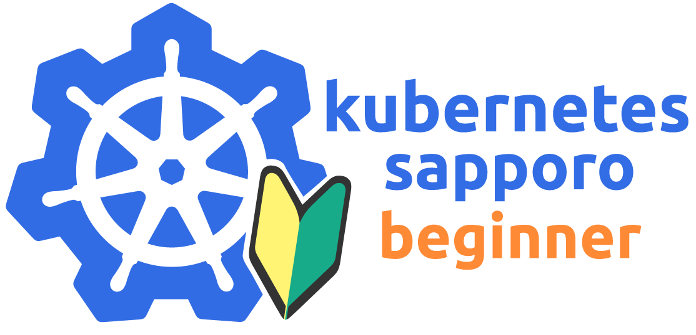

# What is Kubernetes Sapporo for Beginners

`Kubernetes Sapporo for Beginners` は、connpassの勉強会グループです。

https://sapporo-beginner-kubernetes.connpass.com/

札幌にて、Kubernetesを学ぶために作られたユーザーグループです。
主に、下記のようなユーザーを対象に活動しています。

 - Kubernetesに興味がある。
 - 公式ドキュメントだけでは挫折しそうになってしまう。
 - Kubernetesに興味がある人に興味がある。
 - 札幌でKubernetes使っているユーザーと、知り合いたい。

Kubernetesの事をより深く知っている方は、 Kubernetes公式のslack等に参加することをお勧めします。

**オープンな活動を行うユーザーグループです。新しく参加される方をいつでも歓迎します。**

# 本リポジトリの活用に関して

各イベントの資料は、connpassの資料として添付する形で良いです。 
こちらのリポジトリに格納する必要はありません。

connpassの資料として添付しにくい情報のために、本リポジトリを活用します。
具体的には、下記のようなものとなります。

- ハンズオンのためのアプリケーション、及びマニフェストファイル
- 全員でアウトプットした何か・・・など。

# 統制

- [Connpassのイベント参加者向け行動規範](./event-code-of-conduct.md)
- [本リポジトリ参加者向け行動規範](./CODE-OF-CONDUCT.md)

# イベント

現在は、connpassにて、開催をしております。下記ページを確認してください。

[https://sapporo-beginner-kubernetes.connpass.com/event/](https://sapporo-beginner-kubernetes.connpass.com/event/)

# 各リポジトリに関して

## ハンズオン

下記リポジトリに蓄積していきます。 
[https://github.com/kubernetes-sapporo-for-beginners/hands-on](https://github.com/kubernetes-sapporo-for-beginners/hands-on)

また、ハンズオンで利用するアプリケーションは、下記リポジトリに蓄積していきます。 
[https://github.com/kubernetes-sapporo-for-beginners/hands-on-apps](https://github.com/kubernetes-sapporo-for-beginners/hands-on-apps)

これは、Docker  Hubで、Automated Buildされています。 
[https://hub.docker.com/r/k8ssa/](https://hub.docker.com/r/k8ssa/)

